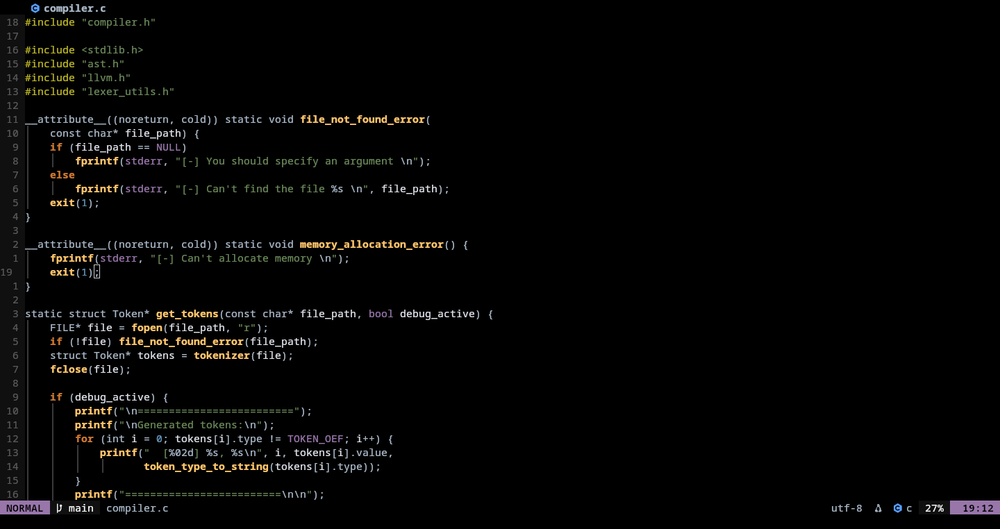

# 🧠 My Neovim Configuration

This is my personal Neovim setup clean, fast, and ready for daily development.  
It includes everything I need: LSP, autocompletion, formatting, Rust and C/C++ support, fuzzy finding, and debugging.

---

## ✨ Features

- **Fast startup** with [lazy.nvim](https://github.com/folke/lazy.nvim)
- **LSP support** via `nvim-lspconfig` and `mason.nvim`
- **Autocompletion** with `nvim-cmp` and `LuaSnip`
- **Formatting & linting** (`clang-format`, `clippy`)
- **Debugging** with `nvim-dap` and `dap-ui`
- **Rust enhanced** support via `rust-tools.nvim`
- **Fuzzy finder** powered by `telescope.nvim`
- **Crate manager** for Rust (`crates.nvim`)
- **Indent guides**, statusline, bufferline, and more UI polish
- **Modular plugin** setup for easy customization

---

## 📁 Plugin Structure

Your plugins are organized under `lua/plugins/` using Lazy's modular approach.

